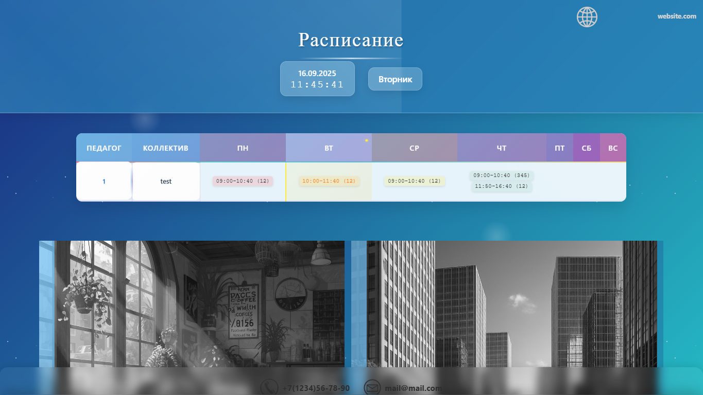
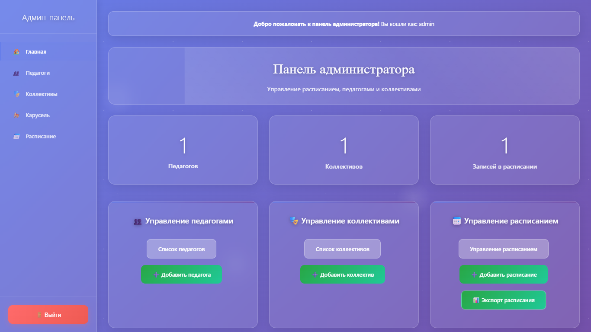
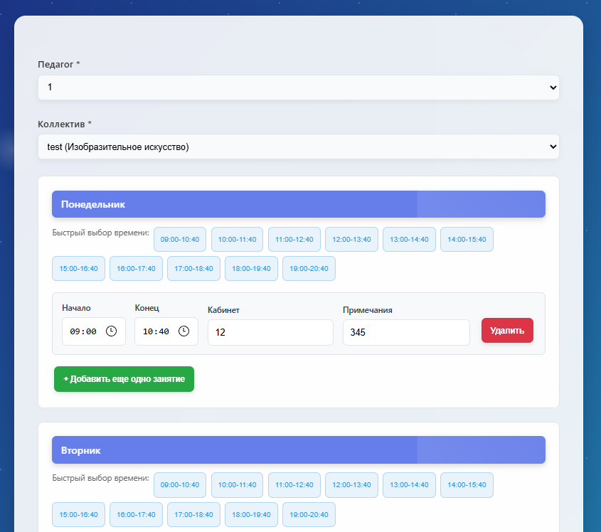
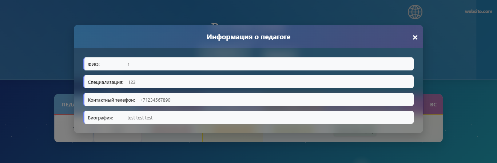

# Kiosk Project

## Описание проекта

Kiosk Project - это веб-приложение для информационных киосков в образовательных учреждениях. Система предназначена для отображения расписания занятий, информации о педагогах и коллективах, а также для показа изображений в виде карусели. Проект разработан специально для школ и других образовательных учреждений, где требуется простой и надежный способ предоставления информации посетителям и ученикам.

Основное назначение - создание интерактивного информационного дисплея, который можно разместить в холлах, коридорах или других общественных местах школы. Система не требует сложной настройки базы данных, используя файлы JSON для хранения данных, что делает ее легкой в развертывании и обслуживании.

## Для кого предназначен проект

- Школы и гимназии
- Детские сады
- Колледжи и техникумы
- Другие образовательные учреждения

## Основные возможности

### 📅 Отображение расписания
- Динамическое отображение расписания занятий
- Информация о времени и группах
- Адаптивный дизайн для различных экранов

### 👥 Управление педагогами
- Добавление, редактирование и удаление информации о преподавателях
- Управление видимостью записей
- Сортировка и организация данных

### 🎭 Управление коллективами
- Создание и управление информацией о творческих коллективах
- Добавление описаний и изображений
- Гибкая система сортировки

### 🎠 Карусель изображений
- Загрузка и отображение изображений
- Управление контентом через админ-панель
- Поддержка различных форматов (JPEG, PNG, GIF, WebP)

### 🔐 Админ-панель
- Защищенный доступ с авторизацией
- Интуитивный интерфейс управления
- Валидация данных и обработка ошибок

## Скриншоты

### Главная страница


Главная страница отображает расписание и основную информацию для посетителей.

### Страница входа в админ-панель


Защищенный вход для администраторов системы.

### Админ-панель


Интерфейс управления контентом с боковым меню навигации.

### Добавление нового поста


Форма для добавления изображений в карусель изображений, добавление педагогов, коллективов и расписания, редактирование описания, песта занятий, данных о педагоге, коллективе и примечания к занятиам.

### Всплывающее окно


Интерактивные элементы для дополнительной информации.

## Технологии

- **Backend**: PHP 7.0+
- **Frontend**: HTML5, CSS3, JavaScript (ES6+)
- **Хранение данных**: JSON файлы (файловая база данных)
- **Стилизация**: Собственные CSS стили с адаптивным дизайном
- **Безопасность**: Сессионная авторизация

## Установка и запуск

### Требования
- Веб-сервер с поддержкой PHP (Apache, Nginx)
- PHP 7.0 или выше
- Доступ на запись в директории проекта

### Шаги установки

1. **Скачайте проект**
   ```bash
   git clone https://github.com/DByXCoTbIN/kiosk-project.git
   cd kiosk-project
   ```

2. **Настройте права доступа**
   ```bash
   chmod 755 config/
   chmod 755 css/img/
   chmod 755 data/
   ```

3. **Настройте админ-доступ**
   - Отредактируйте файл `config/admin_users.json` для добавления пользователей
   - Или используйте существующие учетные данные

4. **Разместите на сервере**
   - Скопируйте файлы в корневую директорию веб-сервера
   - Убедитесь, что PHP включен

5. **Проверьте работу**
   - Откройте браузер и перейдите к `index.php`
   - Для админ-доступа используйте `/admin/login.php` или изображение в правом верхнем углу (предназначено для скрытного доступа в админ панель, поскольку расписание должно стоять в людном месте и не иметь визуального доступа к админ панели)

## Использование

### Для посетителей
- Просмотр расписания на главной странице
- Информация о педагогах и коллективах
- Просмотр карусели изображений

### Для администраторов
1. Войдите в админ-панель через `/admin/login.php`
2. Управляйте контентом через соответствующие разделы:
   - **Педагоги**: Добавление/редактирование информации о преподавателях
   - **Коллективы**: Управление творческими группами
   - **Карусель**: Загрузка и управление изображениями
   - **Расписание**: Просмотр и управление расписанием

## Структура проекта

```
kiosk-project/
├── admin/              # Админ-панель
├── config/             # Конфигурационные файлы
├── css/                # Стили и изображения
├── data/               # JSON данные
├── page/               # Дополнительные страницы
├── README-img/         # Изображения для README
├── index.php           # Главная страница
└── README.md           # Этот файл
```

## Особенности

- **Простота развертывания**: Не требует установки базы данных
- **Адаптивный дизайн**: Работает на различных устройствах
- **Файловая система**: Все данные хранятся в JSON файлах
- **Безопасность**: Защищенная админ-панель с авторизацией
- **Локализация**: Интерфейс на русском языке

## Разработка и вклад

Проект открыт для вклада сообщества. Если вы хотите улучшить систему:

1. Форкните репозиторий
2. Создайте ветку для вашей фичи
3. Внесите изменения
4. Создайте Pull Request

### Требования к коду
- Следуйте PSR-стандартам для PHP
- Используйте семантические коммиты
- Добавляйте комментарии к сложным участкам кода

## Лицензия

Этот проект распространяется под лицензией MIT. Подробности в файле LICENSE.

## Контакты

Если у вас есть вопросы или предложения, создайте Issue в репозитории GitHub.

---

*Разработано для образовательных учреждений с ❤️*
